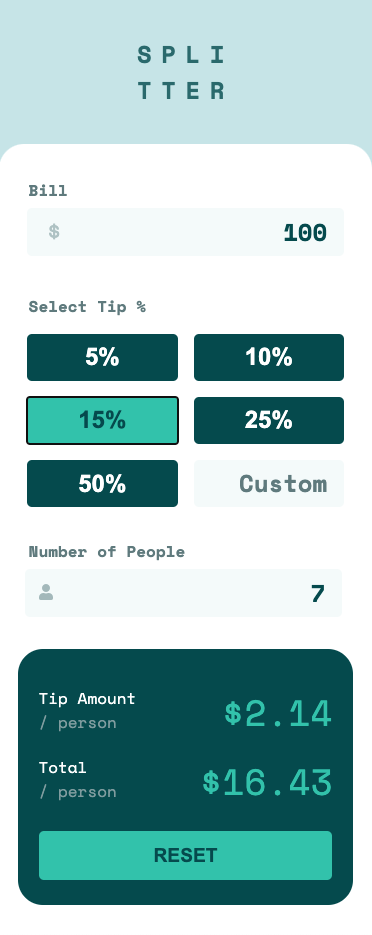

# Frontend Mentor - Tip calculator app solution

This is a solution to the [Tip calculator app challenge on Frontend Mentor](https://www.frontendmentor.io/challenges/tip-calculator-app-ugJNGbJUX). Frontend Mentor challenges help you improve your coding skills by building realistic projects.

## Table of contents

-   [Overview](#overview)
    -   [The challenge](#the-challenge)
    -   [Screenshot](#screenshot)
    -   [Links](#links)
-   [My process](#my-process)
    -   [Built with](#built-with)
    -   [What I learned](#what-i-learned)
    -   [Continued development](#continued-development)
    -   [Useful resources](#useful-resources)
-   [Author](#author)

## Overview

### The challenge

Users should be able to:

-   View the optimal layout for the app depending on their device's screen size
-   See hover states for all interactive elements on the page
-   Calculate the correct tip and total cost of the bill per person

### Screenshot

### Links

-   Solution URL: [Frontend Mentor](https://www.frontendmentor.io/challenges/tip-calculator-app-ugJNGbJUX/hub/splitter-tip-calculator-using-react-styled-components-js-htmlcss-EYCFDj5g5)
-   Live Site URL: [Splitter Tip Calculator](https://splitter-tip-calculator.scottjohnston.dev)

## My process

### Built with

-   HTML5 markup
-   CSS
-   Flexbox
-   Mobile-first workflow
-   [React](https://reactjs.org/) - JS library
-   [Styled Components](https://styled-components.com/) - For styles

### What I learned

More exposure to styled components in React.

### Continued development

I plan to continue getting more familiar and experience with Styled Components. Also need to refactor a number of areas.

## Author

-   Website - [Scott Johnston](https://www.scottjohnston.dev)
-   Frontend Mentor - [@SJ47](https://www.frontendmentor.io/profile/SJ47)
-   Twitter - [@scottJ_Dev](https://www.twitter.com/scottJ_Dev)
